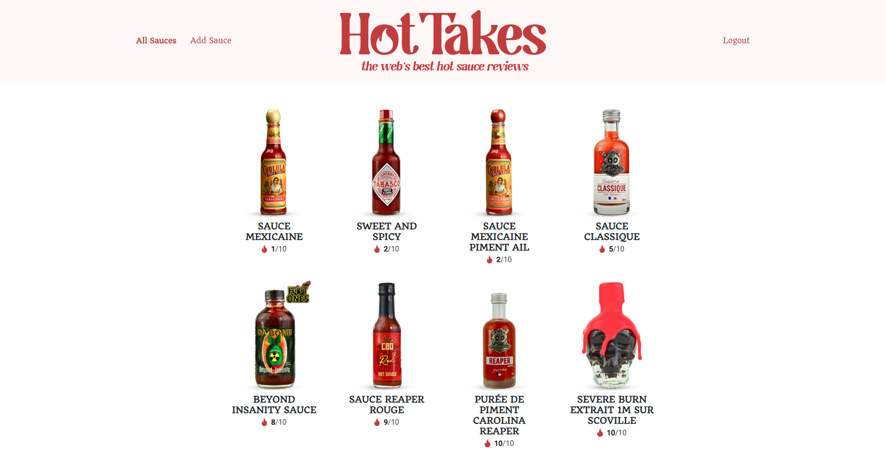

# HotTakes
### OpenClassrooms P6 - Construisez une API sécurisée pour une application d'avis gastronomiques

**HotTakes** est une application web de critique des sauces piquantes, développée par la marque de condiments à base de piment *Piiquante*. Les sauces piquantes sont de plus en plus populaires, en grande partie grâce à la série YouTube *"Hot Ones"*, cette application serait donc une "galerie de sauces" permettant aux utilisateurs de télécharger leurs sauces piquantes préférées et de liker ou disliker les sauces partagées par les membres de sa communauté. Le **front-end** de l'application a été développé à l'aide d'**Angular** et a été précompilé après des tests internes, l'objectif de ce projet est donc de **construire l'API** de la partie **back-end**.

## Spécifications de l'API

* POST `/api/auth/signup` : Création d'un utilisateur, hashage de son mot de passe et ajout à la base de données
* POST `/api/auth/login` : Identification d'un utilisateur, vérification de ses informations et création d'un token d'authentification
* GET `/api/sauces` : Renvoie un tableau de toutes les sauces de la base de données
* GET `/api/sauces/:id` : Renvoie une sauce avec l'identifiant fourni
* POST `/api/sauces` : Création d'une sauce, capture son image, initialise les likes/dislikes et ajout à la base de données
* PUT `/api/sauces/:id` : Met à jour la sauce avec l'identifiant fourni
* DELETE `/api/sauces/:id` : Supprime la sauce avec l'identifiant fourni
* POST `/api/sauces/:id/like` : Ajoute un like, un dislike ou enlève un like/dislike

## Exigences de sécurité

* Le mot de passe de chaque utilisateur est hashé
* L'authentification est renforcée sur toutes les routes sauce requises
* Les adresses e-mail dans la base de données sont uniques

*Produits extraits de [sauce-piquante.fr](https://www.sauce-piquante.fr), police du logo \: [Magilio](https://www.behance.net/gallery/119990601/Magilio-A-Chic-Serif-Fonts)*
